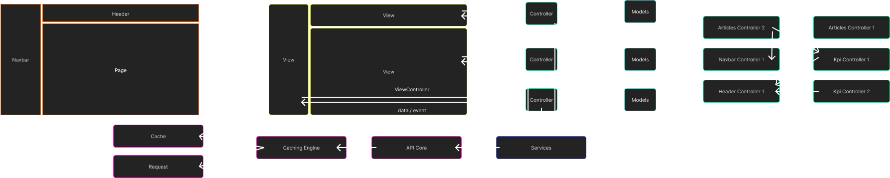

# React MVVM Framework

This project is a framework for creating web applications following the **MVVM** (Model-View-ViewModel) architecture using **React**.

## Features

- **MVVM Architecture**: A clear separation of concerns between the model, view, and view model.
- **Fast development** with [Vite](https://vitejs.dev/), providing instant server startup and optimized builds.
- **Reactive Components**: Built with React to manage the user interface, with business logic encapsulated within the ViewModels.
- **TypeScript support**: Ensuring a safer and more scalable development experience.
